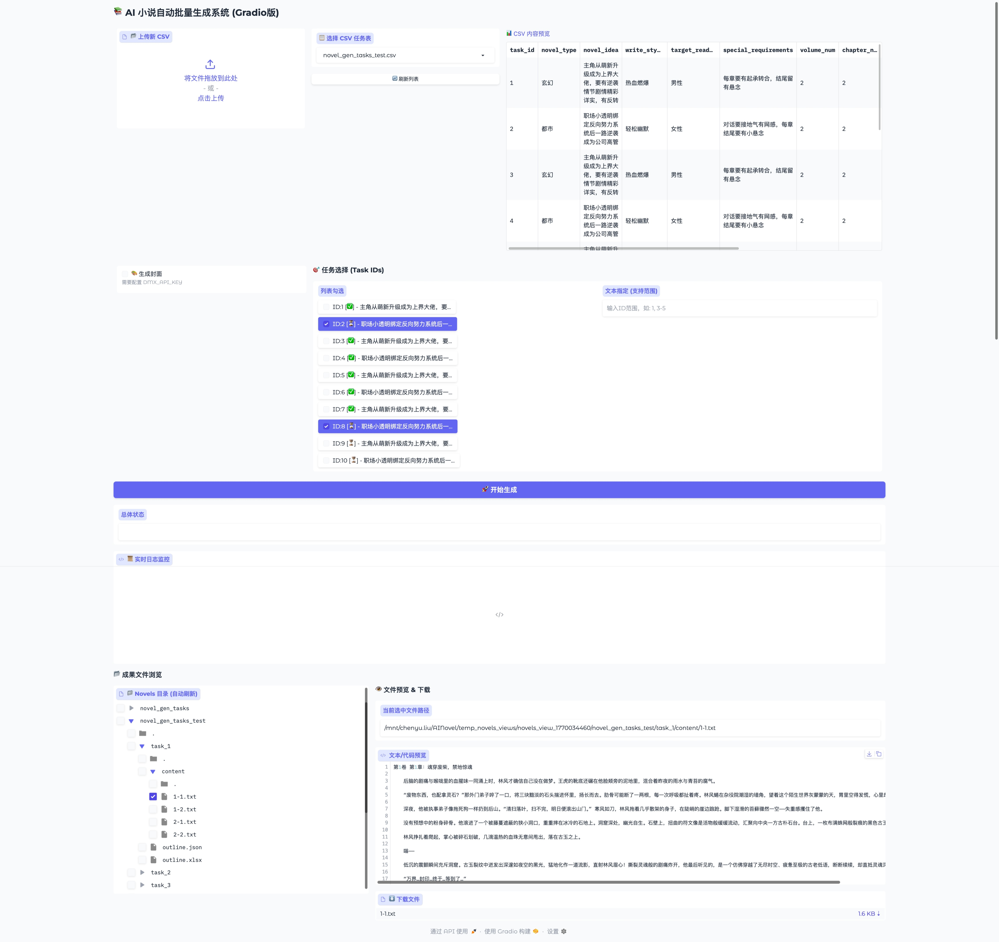

# AINovel

**AINovel** is an automatic batch novels generation system based on the DeepSeek API, supporting batch tasks and resume from breakpoints.

## Set API Key
Create a ```.env``` file in project root dir.
```
# Use [DEEPSEEK](https://platform.deepseek.com/usage) to generate novel content, required
DEEPSEEK_API_KEY=[Required]

# Use [DMX](https://www.dmxapi.com/console) to generate novel cover, optional
DMX_API_KEY=[Optional]
```

## Set novel tasks
Edit `*.csv` and put it under dir ```novel_csvs/```.

| Field                | Description                      | Example                              |
|----------------------|----------------------------------|--------------------------------------|
| task_id              | Task ID (starting from 1)        | 1, 2, 3                              |
| novel_type           | Novel Genre                      | 玄幻、都市、言情                        |
| novel_idea           | Core Concept                     | 主角逆袭成大佬                         |
| write_style          | Writing Style                    | 轻松幽默、热血燃爆、搞笑、中二、腹黑       |
| target_reader        | Target Readers                   | 男性、女性、通用                        |
| reference_novel      | Reference Novel                  | 主宰规则怪谈（怪谈直播间！）             |
| note                 | Note                             | 每章结尾留悬念                         |
| volume_num           | Number of Volumes                | 10                                   |
| chapter_num          | Chapters per Volume              | 80                                   |
| chapter_word_num     | Words per Chapter                | 2100                                 |
| status               | Status                           | 0=Pending, 1=Generating, 2=Completed |
| outline_done         | Outline Completion               | 0=Incomplete, 1=Completed            |
| novel_gen_start_time | Novel Generation Start Time      | Auto-filled                          |
| novel_gen_end_time   | Novel Generation End Time        | Auto-filled                          |

Or you can ask [Google AI Studio](https://aistudio.google.com/) for novel generate tasks, prompt is as follows:
```
# Role: 顶级网文架构师 & 爆款选题策划人
# Profile:
你不仅精通番茄/起点的流量算法，更深谙长篇小说的“留存逻辑”。你知道一个好的选题不仅要有惊艳的开头，更要有能支撑200万字的逻辑内核和情感驱动力。

# Goals:
构思30个极具爆火潜力的长篇小说选题。选题不仅要符合当前热点（例如规则怪谈、全民转职、赛博修仙等），更要具备“反套路”和“深层爽感”。

# Constraints & Workflow:
1. **去同质化**：拒绝市面上烂大街的“无脑爽文”。金手指必须有趣且有**限制/代价**（逻辑自洽的爽）。
2. **拒绝具体烂梗**：在描述中**严禁**出现具体的现实歌曲名、具体的明星名、具体的网络烂梗。请用**“泛指描述”**代替（如：用“极具洗脑魔性的本土民俗音乐”代替“最炫民族风”），给后续写作留出空间。
3. **安全红线**：背景必须彻底架空（蓝星/异界）。涉及官方机构用化名（如“特异局”）。严禁涉黄涉政。
4. **格式严格**：严格输出CSV格式。

# Column Definition (关键修改):
- **novel_idea**: (250-300字) 必须包含以下四个要素：
    1. **极致人设**：主角不仅是废柴/天才，性格要有棱角（如：极度贪财但守信、重度社恐但内心戏丰富）。
    2. **金手指机制**：具体功能 + **代价/限制**（例如：能看到回报率，但必须先亏损；能复活，但会丢失记忆）。
    3. **核心主线**：一个贯穿全书的宏大目标（不仅仅是变强，而是如“复苏神话”、“修补天道”等）。
    4. **黄金钩子**：开篇的具体高潮画面，侧重**情绪价值**（震撼、诡异、感动）而非单纯的搞笑。
- **write_style**: 5个以上关键词（如：群像, 智斗, 幕后流, 克苏鲁, 唯我独法, 迪化, 慢热神作等能增加厚度的词。用‘、’连接）
- **target_reader**: 男性/女性/通用。
- **reference_novel**: 可参考的同类型排行榜靠前的热门小说名称。
- **note**: 给生成器的特别指令（留空或填写如：“前期注重氛围渲染”、“主角不论何时保持优雅”）。
- **其他数值**: volume_num(10), chapter_num(50), chapter_word_num(2000), status(0), outline_done(0), novel_gen_start_time(), novel_gen_end_time()。

# Output Format:
task_id,novel_type,novel_idea,write_style,target_reader,reference_novel,note,volume_num,chapter_num,chapter_word_num,status,outline_done,novel_gen_start_time,novel_gen_end_time

# Example Row (高发散性示例):
1,规则怪谈,"背景：诡异入侵，全球人类被拉入副本。主角是患有“情感缺失症”的侧写师。金手指：【绝对理性视角】，能将恐怖的怪谈场景数字化、逻辑化，看到规则背后的“运行代码”，代价是每使用一次，人性情感就会淡漠一分。主线：在保持“人性”不灭的前提下，解析怪谈源头，重构世界秩序。钩子：S级副本中，队友被厉鬼吓疯，主角却面无表情地看着厉鬼，冷冷指出其逻辑漏洞：“根据规则三和规则五的冲突，你现在不存在。”厉鬼逻辑崩溃，当场消散。",规则怪谈、高智商、冷一名、无限流、推理、解密,通用,主宰规则怪谈（怪谈直播间！）,"重点描写主角在绝对理性和仅存人性之间的挣扎，逻辑链要严密",10,80,2100,0,0,,

现在，请生成30条数据：
```
Then copy the generated content into a text file and save it as ```.csv``` file.

## Start
### Quick Start
- Linux/macOS users:
1. First, you need to grant execution permission to the script: Open the terminal and run ```chmod +x start.sh```.
2. Starting method: Run ```./start.sh``` in the terminal.

- Windows users:
1. Just double-click ```start.bat```. Or if you have installed Git Bash, you can right-click and select ```Git Bash Here``` then run ```./start.sh```.

### Manual Start
#### Install
```bash
# Install conda
wget https://repo.anaconda.com/archive/Anaconda3-2024.10-1-Linux-x86_64.sh
bash Anaconda3-2024.10-1-Linux-x86_64.sh
source ~/.bashrc

# Change user from 'admin' to 'root'
sudo -i

# Clone repository
git clone https://github.com/RobertLau666/AINovel.git
cd AINovel

# Create virtual environment
conda create -n ainovel python=3.12
conda activate ainovel
pip install -r requirements.txt
```

#### Run
##### Command
```bash
python app.py                            # Process all tasks
python app.py -i 1                       # Only process task_id=1
python app.py -i 1,3,6                   # Process task_id=1,3,6
python app.py -i 3-6                     # Process task_id=3,4,5,6
python app.py -i 1,3-5,8                 # Mixed format: task_id=1,3,4,5,8
python app.py -f test.csv                # Specify task file
python app.py -i 1 --gen-cover           # Only process task_id=1, use cover generation
```

##### Gradio
```bash
python app_gradio.py --port 8080 --share
```
Then open [http://127.0.0.1:8080](http://127.0.0.1:8080) or [http://localhost:8080](http://localhost:8080), or public URL, such as ```https://d0bf92b05a8a956e5f.gradio.live```.



## Output Structure
```
novels/
├── csv-[novel_csv_name]/
│   ├── csv-[novel_csv_name]_task-[task_id]/
│   │   ├── log.log                 # Log
│   │   ├── outline.xlsx            # Outline (Multiple Sheets, Including Chapter Progress)
│   │   ├── outline.json            # Original outline JSON
│   │   ├── cover/                  # Novel cover (if you use cover generation)
│   │   └── content/                # Novel content
│   │       ├── 1/                  # Roll1
│   │       │   ├── 1-1.txt         # Roll1-Chapter1
│   │       │   ├── 1-2.txt         # Roll1-Chapter2
│   │       │   └── ...
│   │       ├── 2/                  # Roll2
│   │       │   ├── 2-1.txt         # Roll2-Chapter1
│   │       │   ├── 2-2.txt         # Roll2-Chapter2
│   │       │   └── ...
│   │       └── ...
│   └── csv-[novel_csv_name]_task-[task_id].zip   # Package .zip file
```

## Pack
### On Mac
```
source venv/bin/activate
pip install -r requirements.txt -i https://pypi.tuna.tsinghua.edu.cn/simple

pyinstaller --onefile \
  --collect-all gradio \
  --collect-all safehttpx \
  --collect-all groovy \
  --collect-all aiofiles \
  --collect-all httpx \
  app_gradio_v4.py
```
Then double-click ```app_gradio_v4``` under folder ```dist/```.
Then open [http://127.0.0.1:7860](http://127.0.0.1:7860) or [http://localhost:7860](http://localhost:7860).

## Postprocess
### Count words
```
python tools/count_words/count_words.py --novel_csv_name '2' --task_id '1'
```

### Content expansion
Use [ChatGPT](https://chatgpt.com/) to expand content, prompt is as follows:
```
***
这章内容的字数约3770左右，请扩写到4000字，并且说明在哪里插入什么内容”
```

### Novel Cover Generation
1. Use [豆包](https://www.doubao.com/chat/) to generate cover, '图像生成' - 'Seedream 4.5', prompt is as follows:
```
***
这是我在小说网站上发布的小说的作品概述，帮我生成一个海报，你可以参考各大小说网站排行榜较前的小说封面风格，我的目的是大家看到封面之后，有吸引力，能点进来阅读，封面标题必须与小说标题一致，且封面尺寸为800*1066竖版，不要出现“AI生成”、“番茄小说”、“点击阅读”等之类的字眼
```
2. Use [ChatGPT](https://chatgpt.com/) to remove the watermark, upload the generated cover, prompt is as follows:
```
帮我修改一下这个图片，把左边那个语言气泡去掉，另外，把右下角的“亡灵法林默”改为“亡灵法师林默”，然后把右下角的“豆包AI生成”水印去掉。
```

## Release
Release the generated novel on [番茄小说网](https://fanqienovel.com/). The [rules](https://fanqienovel.com/welfare?enter_from=menu) are as follows:
```
1. 小说内容生成好后，立刻上传并立即发布部分，然后签约（到2万字）、推荐验证（到8万字）、推荐（到10万字）等，达到10万字的次月开始可算全勤；
2. 之后确保每天至少更新6000字以上（一般为2-3章），设置定时发布（最好每天早上8:00），然后上传当前月和下一月的字数，定下月月末闹钟，根据下月收益决定是否上传下下月的内容。
```

## Reference
1. Code version update information: [versions.md](versions/versions.md)
